<div align="center">

# Hi, I'm Shaharyar Babar 👋

[](https://git.io/typing-svg)

**8+ years building scalable products where software, spatial data, and real-world operations meet.**

[](https://www.shaharyarbabar.dev/)
[](https://www.linkedin.com/in/shaharyar-babar-77276782/)
[](https://www.upwork.com/freelancers/~011086dbdaa174b0b5)
[](https://www.fiverr.com/shaharyarbabar7)
[](https://github.com/sbabar19?tab=followers)

</div>

## A little about me

I started in **Space Science, GIS, and Remote Sensing** before moving into full-stack product engineering. That background still shapes how I build: data-first, spatially aware, and focused on solving operational problems.

Today, I build logistics, e-commerce, finance, and AI-assisted platforms at **Gneffin**.

```text
📍 Rawalpindi, Pakistan       🧭 Full-stack + Geospatial + AI
💼 Building at Gneffin       🤝 Open to roles and consulting
```

### A few outcomes I'm proud of

- ⚡ Reduced a logistics quotation workflow from **2–3 days to near real time**
- 🗺️ Built QGIS automation that cut digitization time by **70%**
- 🎯 Created spatial QA tooling that improved issue-resolution speed by **73%**
- 🧩 Shipped products across logistics, seller operations, finance, mapping, and AI media processing

---

<div align="center">

### Have an interesting problem to solve?

I'm open to **full-time roles, freelance projects, and technical consulting** involving full-stack platforms, geospatial systems, logistics, e-commerce, and AI-enabled workflows.

[**See my work →**](https://www.shaharyarbabar.dev/#projects)

</div>

## Toolbox

_A practical toolbox built across my public repositories and product work._

### Languages


### Frameworks & runtimes


### UI & interaction


### Editors & documents


### Backend, data & product services


### Media & integrations


### AI & automation


### Geospatial & mapping


### Mobile & Apple platforms


### Python, scraping & data


### Robotics & 3D


### Tooling


## Selected work

- ✍️ [**Compoose**](https://apps.apple.com/us/app/compoose/id6787232053) — Offline macOS writing workspace for focused drafts, structured documents, and private meeting notes—with local recording, transcription, and summaries
- 🔎 [**Compoose Lens**](https://apps.apple.com/us/app/compoose-lens/id6797838494?mt=12) — Native macOS capture and annotation utility with OCR, redaction, and on-device AI actions

## GitHub at a glance

<div align="center">

<a href="https://github.com/sbabar19">
  
</a>
<a href="https://github.com/sbabar19">
  
</a>

</div>

> These cards are generated and refreshed in this repository by [GitHub Actions](./.github/workflows/update-profile-stats.yml), so the profile does not depend on the flaky public stats endpoint. The language card filters out generated and starter repositories to better reflect active product work.
